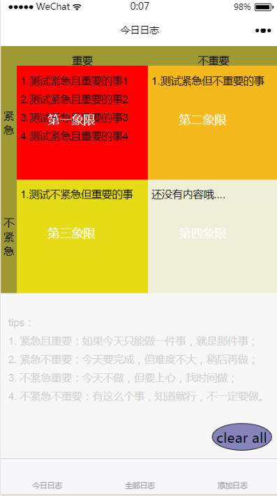
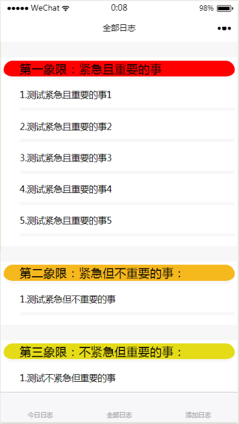
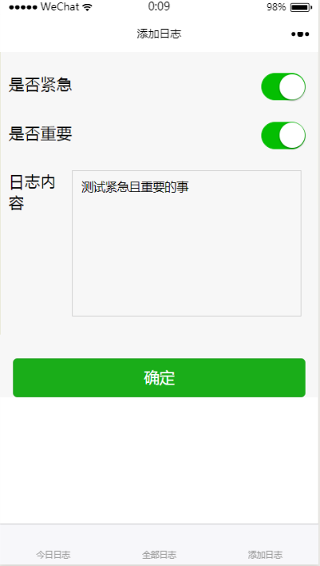

# wx-daily
你的时间有限，不可能做所有事。最重要的事，应该首先做。一个有用的技巧是，将所有任务按照"重要性"和"紧急性"两个维度，分成四个象限。第一象限优先级最高，第四象限最低。

### 扫码体验

### 1. 象限图

注：首页的象限图每个象限只展示四条数据，如果数据不止四条，可以去全部日志 tab 栏中查看。

### 2. 列表

注：展示所有的日志

### 3. 编辑日志

